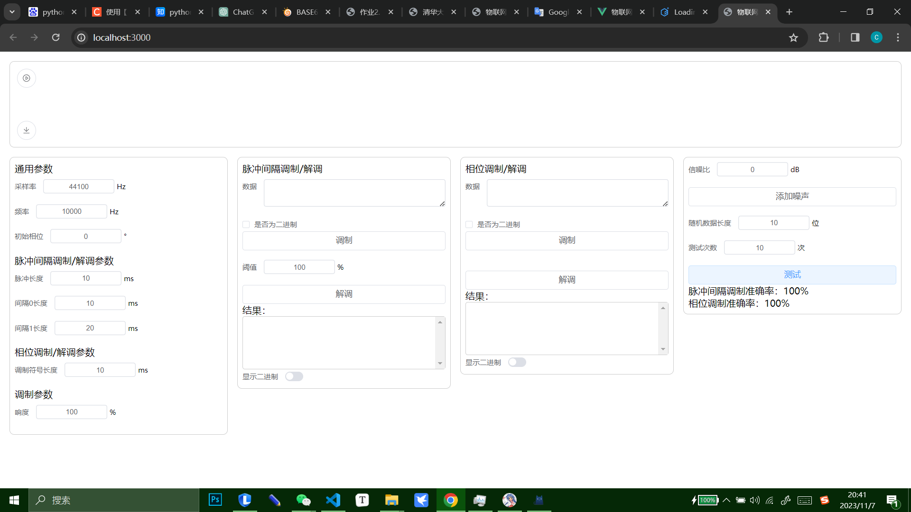

# 文档

## 程序界面

## 实验结果

### 生成音频信号

使用UI左下角的生成工具填写参数后生成音频，波形图绘制在顶部，可点击左上角的下载按钮下载。

### 读取音频文件

使用UI左边的上传工具读取音频文件，波形图绘制在顶部，可点击左上角的播放按钮播放。

### 录音

使用UI下方第二栏的录音界面录音。预览与下载同“生成音频信号”。

### 信号调制

使用UI下方第三栏的调制界面调制信号。预览与下载同“生成音频信号”。

### 信号解调

使用UI右下角的解调界面解调信号。此界面与调制界面共用它上方输入区里的参数。将会使用目前在上方预览框内的音频作为源文件。

